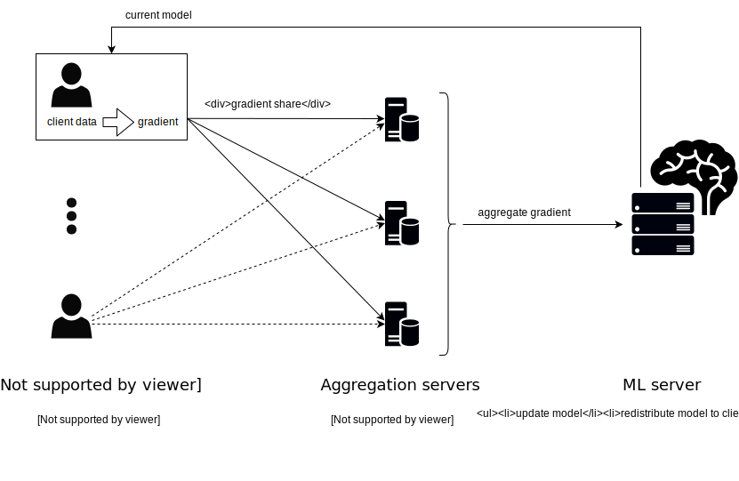

# Differential Privacy for Federated Learning with Secure Aggregation
The goal of this project is to create a system for federated machine learning where differential privacy of any individual client's data can be guaranteed, using [secure aggregation](https://crypto.stanford.edu/prio/) while providing [global differential privacy](https://desfontain.es/privacy/local-global-differential-privacy.html) without requiring trust in a single aggregator.

## Motivation
Machine learning aims to automatically improve a model given sample data. Many problems in the field are formulated as the search for a parameter set to the model that is is optimal w.r.t. some objective function. If the model is suitable (like the ubiquitous [neural network models](https://en.wikipedia.org/wiki/Artificial_neural_network) are), variants of [stochastic gradient descent (SGD)](https://en.wikipedia.org/wiki/Stochastic_gradient_descent) are frequently used to solve said optimization problem.

In a nutshell, SGD computes the gradient of the model together with the objective function w.r.t. the current parameter set at all points from a random subset of the training data. The parameters are then updated in the opposite direction of the gradient sum. Intuitively, this moves the parameters in the direction of approximately the steepest ascent, hence hopefully towards a local maximum, of the objective function. This process is iterated until performance is statisfactory.

Two privacy issues that arise when training on sensitive data are considered here:
- The party executing the SGD computation has access to all data.
- The model resulting from the training may be vulnerable to [inference attacks](https://arxiv.org/abs/1610.05820), even for an adversary that only has query access.

## Approach
We suggest the following solution:
- **Federated learning with secure aggregation**. The gradients are computed locally by the data owners (referred to as "clients" hereafter). The gradient sum is computed by servers following a [secure aggregation protocol](https://datatracker.ietf.org/doc/draft-irtf-cfrg-vdaf/) where noone but the client ever sees their data in plain text. The model update is then performed publicly and used for the next iteration.

- **[Differential privacy (DP)](https://desfontain.es/privacy/differential-privacy-awesomeness.html)**. A calibrated amount of noise is added to the gradients in each update step, trading model performance for protection of client privacy.
   - The straightforward way of doing federated private learning is [local DP](https://desfontain.es/privacy/local-global-differential-privacy.html), making the clients add the noise locally before transmitting to the aggregation servers. This is great because it does not require trust in the aggregators. It has downsides though: The total noise is much larger than strictly necessary, as each client has to add the total amount of noise in case another client maliciously refrains from adding any noise. This affects model performance.
   - [Global DP](https://desfontain.es/privacy/local-global-differential-privacy.html) to the rescue! The aggregation server adds the noise after computing the gradient sum. An arising problem in the federated setting is that the noise is calibrated under the assumption that the L2 norm of the gradients is bounded by 1, but the server only ever sees the gradient in cyphertext and cannot check. Luckily, the [VDAF protocols](https://datatracker.ietf.org/doc/draft-irtf-cfrg-vdaf/) allow the aggregator to compute certain verification functions on client submissions without knowing the plain text. This can be leveraged to ensure the norm bound server-side.

## Setup

The following entities participate:
1. The **clients** hold sensitive data on which the machine learning task is supposed to be executed.
2. The **aggregation servers** perform gradient aggregation without seeing plaintext submissions.
3. The **ML server** holds the current model, updates according to gradient aggregates, and distributes the update.

We aim to provide the following privacy guarantees:
- **Anonymity** (no adversary can tell which client submitted which data value) and **privacy** (no adversary learns anything about an honest clients' data values except the aggregate) an be guaranteed if
   - all clients are malicious
   - at least one aggregation server is honest but curious, the remaining ones are malicious
   - the ML server is malicious
- [**Differential privacy**](https://en.wikipedia.org/wiki/Differential_privacy) can be guaranteed if
   - all clients are malicious
   - all aggregation servers are honest but curious
   - the ML server is malicious

Correctness of the result of the learning procedure requires honesty of all participants. As differential privacy persists even for malicious clients, the learning result is guaranteed to at least be robust towards data poisoning in that case.

## How it works
1. The ML server distributes its current model to the clients.
2. Each client locally computes the gradient vector for that model based on its data.
3. Each client splits its gradient vector into *gradient shares* and submits
   a share to each aggregation server.
4. The aggregation servers verify that the submitted vectors are well-formed (clipped, with L2 norm less than 1).
   This is done in a distributed way, without any knowledge being gained about the values of the clients' submissions.
5. Each aggregation server adds noise to the clients' shares to provide pre-established privacy guarantees.
5. The aggregation servers compute the *aggregate gradient* as a sum of all client gradients, again in a distributed fashion. The aggregate contains noise from all the
   aggregation servers and is sent to the ML server.
6. The ML server updates its model and can initiate a new training round.

## Roadmap
- [x] For aggregation of gradient vectors we use [prio-rs](https://github.com/divviup/libprio-rs) with [fixed-point vectors](https://github.com/dpsa-project/libprio-rs). Its mechanism for zero-knowledge proofs on secret-shared data (which is used for verifying that gradient vectors are bounded) is described [here](https://crypto.stanford.edu/prio) and [here](https://eprint.iacr.org/2019/188). [This is done!](https://github.com/divviup/libprio-rs/pull/283)
- [x] Integrate our new type into [janus](https://github.com/divviup/janus) which will provide the client/server infrastructure. [This is done!](https://github.com/divviup/janus/pull/893)
- [x] Implement [discrete Gaussian sampling](https://arxiv.org/abs/2004.00010) and use it to add Differential Privacy to our prio type. [This is done!](https://github.com/dpsa-project/libprio-rs/blob/feature-simple-dp/src/flp/types/fixedpoint_l2/noise.rs)
- [x] Use this with the [flower](https://github.com/adap/flower) framework for federated learning in python. [This is done!](https://github.com/dpsa-project/dpsa4fl-example-project)
- [ ] Get our additions to janus and libprio accepted as pull requests.

## Implementation
This projects involves many repositories, the dependencies between them are as follows.

*Please note that libprio-rs and janus are not part of this project, we merely integrate some changes required for our use-case upstream.*

- [**libprio-rs**](https://github.com/divviup/libprio-rs): we define a prio3 type with the purpose of
   securely aggregating gradient vectors from clients. This code is integrated upstream in the libprio-rs repository.
- [**janus**](https://github.com/divviup/janus): we add the necessary plumbing code for our new type to janus.
- [**dpsa4fl**](https://github.com/dpsa-project/dpsa4fl) depends on janus, it contains the core of our project: code necessary to interact with
   janus servers specifically in the setting of federated learning.
- [**dpsa4fl-bindings.py**](https://github.com/dpsa-project/dpsa4fl-bindings.py) is a wrapper around dpsa4fl, and is released
   as a python package that can be downloaded from [PyPi](https://pypi.org/project/dpsa4fl-bindings/).
- [**dpsa4fl-janus-tasks**](https://github.com/dpsa-project/dpsa4fl-janus-tasks) is a small rust binary that allows for remote provision of tasks for janus, something that is currently not implemented in janus itself (https://github.com/divviup/janus/issues/760).~~ Currently this binary is included in our janus fork.
- [**dpsa4fl-testing-infrastructure**](https://github.com/dpsa-project/dpsa4fl-testing-infrastructure) contains a docker-compose file and further configuration files with which a local janus instance can be started (for testing purposes only).
- [**dpsa4flower**](https://github.com/dpsa-project/dpsa4flower) implements client and server to use the [flower framework](https://github.com/adap/flower) for federation.
- [**dpsa4fl-example-project**](https://github.com/dpsa-project/dpsa4fl-example-project) is
   a fully working example of how to use dpsa4fl (via our python bindings) with the flower framework for differentially private federated learning.

## Notes
This project is funded through the NGI Assure Fund, a fund established by NLnet with financial support from the European Commission's Next Generation Internet programme, under the aegis of DG Communications Networks, Content and Technology under grant agreement No 957073.

